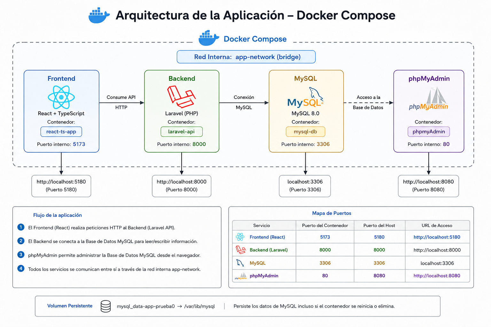

# 🚀 Sistema Full Stack con Docker Compose (React + Laravel + MySQL)


Este proyecto es una arquitectura **full stack containerizada** utilizando Docker Compose, que integra un frontend moderno en React, un backend en Laravel y una base de datos MySQL, junto con phpMyAdmin para administración visual.

---

# 📌 Tabla de Contenidos

* [🧱 Arquitectura General](#-arquitectura-general)
* [⚙️ Servicios](#️-servicios)

  * Frontend (React + TypeScript)
  * Backend (Laravel)
  * Base de Datos (MySQL)
  * phpMyAdmin
* [🌐 Red Interna](#-red-interna)
* [💾 Persistencia de Datos](#-persistencia-de-datos)
* [🚀 Flujo del Sistema](#-flujo-del-sistema)
* [📍 Accesos Locales](#-accesos-locales)
* [🧠 Notas Técnicas](#-notas-técnicas)
* [📦 Docker Compose](#-docker-compose)

---

# 🧱 Arquitectura General

Este sistema está diseñado bajo una arquitectura de microservicios containerizados:

```
Frontend (React + TS)
        ↓
Backend (Laravel API)
        ↓
Database (MySQL 8)
        ↓
phpMyAdmin (gestión visual)
```

Todos los servicios se comunican a través de una red interna de Docker (`app-network`).

---

# ⚙️ Servicios

## 🎨 Frontend (React + TypeScript)

Aplicación cliente encargada de la interfaz de usuario.

### 📌 Configuración

* Contenedor: `react-ts-app`
* Puerto: `5180:5173`
* Framework: React + TypeScript + Vite (o similar)

### 🧩 Build

```yaml
build:
  context: ./front-end-REACT-TS
  dockerfile: Dockerfile
```

### 📁 Volúmenes

```yaml
volumes:
  - ./front-end-REACT-TS:/var/www/app
  - /var/www/app/node_modules
```

---

## ⚙️ Backend (Laravel API)

API principal del sistema.

### 📌 Configuración

* Contenedor: `laravel-api`
* Puerto: `8000:8000`
* Framework: Laravel + PHP

### 🧩 Build

```yaml
build:
  context: ./back-end-PHP-Laravel
  dockerfile: Dockerfile
```

### 🔐 Variables de entorno

```env
DB_CONNECTION=mysql
DB_HOST=mysql
DB_PORT=3306
DB_DATABASE=AppMensajes
DB_USERNAME=root
DB_PASSWORD=root123
```

### ▶️ Ejecución

```bash
php artisan serve --host=0.0.0.0 --port=8000
```

### 📁 Volúmenes

```yaml
volumes:
  - ./back-end-PHP-Laravel:/var/www/html
  - /var/www/html/vendor
```

---

## 🗄️ Base de Datos (MySQL 8.0)

Motor de base de datos relacional.

### 📌 Configuración

* Contenedor: `mysql-db`
* Puerto: `3306:3306`

### 🔐 Variables de entorno

```env
MYSQL_DATABASE=AppMensajes
MYSQL_USER=app_user
MYSQL_PASSWORD=secret123
MYSQL_ROOT_PASSWORD=root123
```

### 💾 Persistencia

```yaml
volumes:
  - mysql_data-app-prueba0:/var/lib/mysql
```

---

## 🧰 phpMyAdmin

Interfaz web para administración de MySQL.

### 📌 Configuración

* Contenedor: `phpmyadmin`
* Puerto: `8080:80`

### 🔐 Acceso

```env
PMA_HOST=mysql
PMA_PORT=3306
MYSQL_ROOT_PASSWORD=root123
```

Acceso: [http://localhost:8080](http://localhost:8080)

---

# 🌐 Red Interna

Todos los servicios se comunican mediante una red Docker bridge:

```yaml
networks:
  app-network:
    driver: bridge
```

📡 Comunicación entre servicios:

* `frontend → backend`
* `backend → mysql`
* `phpmyadmin → mysql`

---

# 💾 Persistencia de Datos

Se utiliza un volumen para asegurar la persistencia de la base de datos:

```yaml
volumes:
  mysql_data-app-prueba0:
```

---

# 🚀 Flujo del Sistema

1. MySQL inicializa y crea la base de datos `AppMensajes`
2. Laravel backend se conecta a MySQL vía `mysql`
3. React frontend consume API en `http://localhost:8000`
4. phpMyAdmin permite administración visual de la base de datos

---

# 📍 Accesos Locales

| Servicio    | URL                                            |
| ----------- | ---------------------------------------------- |
| Frontend    | [http://localhost:5180](http://localhost:5180) |
| Backend API | [http://localhost:8000](http://localhost:8000) |
| phpMyAdmin  | [http://localhost:8080](http://localhost:8080) |
| MySQL       | localhost:3306                                 |

---

# 🧠 Notas Técnicas

* `php artisan serve` es solo para desarrollo.
* En producción se recomienda Nginx o Apache.
* `node_modules` y `vendor` están aislados para evitar conflictos.
* Asegúrate de tener los puertos libres antes de ejecutar.
* Ideal para entornos de desarrollo local y pruebas.

---

# 📦 Docker Compose

```yaml
version: '3.9'

services:

  frontend:
    container_name: react-ts-app
    build:
      context: ./front-end-REACT-TS
      dockerfile: Dockerfile
    ports:
      - "5180:5173"
    volumes:
      - ./front-end-REACT-TS:/var/www/app
      - /var/www/app/node_modules
    stdin_open: true
    tty: true
    depends_on:
      - backend
    networks:
      - app-network

  backend:
    container_name: laravel-api
    build:
      context: ./back-end-PHP-Laravel
      dockerfile: Dockerfile
    ports:
      - "8000:8000"
    volumes:
      - ./back-end-PHP-Laravel:/var/www/html
      - /var/www/html/vendor
    depends_on:
      - mysql
    environment:
      DB_CONNECTION: mysql
      DB_HOST: mysql
      DB_PORT: 3306
      DB_DATABASE: AppMensajes
      DB_USERNAME: root
      DB_PASSWORD: root123
    working_dir: /var/www/html
    command: php artisan serve --host=0.0.0.0 --port=8000
    networks:
      - app-network

  mysql:
    container_name: mysql-db
    image: mysql:8.0
    restart: always
    ports:
      - "3306:3306"
    environment:
      MYSQL_DATABASE: AppMensajes
      MYSQL_USER: app_user
      MYSQL_PASSWORD: secret123
      MYSQL_ROOT_PASSWORD: root123
    volumes:
      - mysql_data-app-prueba0:/var/lib/mysql
    networks:
      - app-network

  phpmyadmin:
    container_name: phpmyadmin
    image: phpmyadmin/phpmyadmin
    restart: always
    ports:
      - "8080:80"
    depends_on:
      - mysql
    environment:
      PMA_HOST: mysql
      PMA_PORT: 3306
      MYSQL_ROOT_PASSWORD: root123
    networks:
      - app-network

volumes:
  mysql_data-app-prueba0:

networks:
  app-network:
    driver: bridge
```
# arquitectura de contenedores
